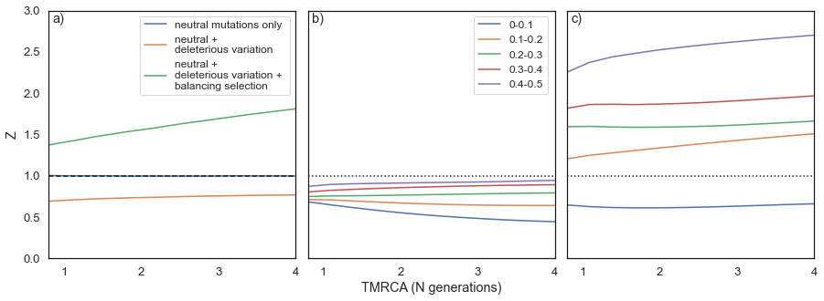

<h2>Research</h2>

As a population genetecist I am interested in how patterns of genetic diversity vary within and between different populations. It's a great time to be involved in this field. 
Where once geneticists had access to data from a small number of loci, the revolution in next generation sequencing means we have access to whole genome sequence data for 
numerous species. The challenge has shifted from attempting to obtain enough data to generate significant results, to attempting to make sense of the large amount of information 
we now have at our disposal. Principally I am a bioinformatician, attempting to generate insights from this data using the vast amount of computing power that labs have access to.

The fundamental forces of evolution are mutation, genetic drift, gene flow and natural selection. Under the supervision of Adam Eyre-Walker at the University of Sussex, 
I have primarily focussed on developing and utilising methods to detect natural selection in humans using DNA sequence data. I am coming towards the end of what has been an
incredibly rewarding time at Sussex and am on the lookout for post-doc positions in suitable labs. Pre-prints and publications will be available soon.

<h2>Current Projects</h2>

I will briefly introduce the four projects I have been working on during my PhD. These summaries barely scratch the surface of the methodologies used and the results obtained so
please do get in touch if you'd like further information about my research.

<h3>A new method to detect balancing selection</h3>
 
The role that balancing selection plays in the maintenance of genetic variation remains unknown. In humans,the signature of balancing selection has been detected at various 
genomic localities, but the overall frequency ofbalancing selection has yet to be quantified. Recent studies have identified loci under long term balancing selection in primates
by identifying polymorphisms shared between two species. These studies have utilised the fact that two speciesare extremely unlikely to share a neutral polymorphism (i.e. they 
are sufficiently divergent that all polymorphism that waspresent in the ancestor of the two species will have gone to fixation in at least one of the species). This makes these 
tests weak because balancing selection must persist for a long time. Together with our collaborator Michiel Vos at the University of Exeter, we present a simple solution that 
allows one to use closely related species or populations.  have developed a new method to detect balancing selection. Neutral polymorphisms are used to inform us what to expect 
under neutrality by comparing the number of polymorphisms shared between two populations, at putatively functional sites with those at putatively neutral sites. Through simulations we have proven that our statistic has power to detect balancing selection. We have applied this statistic to human population genetic data taken from the 1000 genome project. Although we detect balancing selection at low frequencies within humans, the evidence is weak due to the confounding effects of human demographic history. Nature can be 
frustrating at times!

 <figure>
  
  <figcaption>Fig.1 - Simulating our statistic under neutrality (blue), with deleterious mutations introduced (orange), and with neutral, deleterious variation, and balancing selection. tMRCA is measured in N generations, where N is the population size. A log(Z) value of greater than 0 indicates a greater proportion of shared non-synonymous polymorphisms than private non-synonymous polymorphism, which is our signal of balancing selection.</figcaption>
</figure> 

